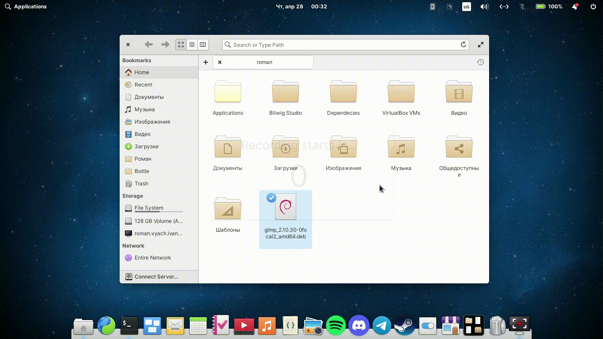

# Contractor file for elementary OS to install .deb packages 

## Installation

Type commands below in your terminal to download and copy`debinstall.contract` file to Contractor directories.

For current user only:
```sh
mkdir -p ~/.local/share/contractor && wget https://raw.githubusercontent.com/Romchec/contractor-deb-install/main/debinstall.contract && mv ./debinstall.contract ~/.local/share/contractor/
```
For all users(don't forget to give permission to move file to root directory):
```sh
sudo mkdir -p /usr/share/contractor && wget https://raw.githubusercontent.com/Romchec/contractor-deb-install/main/debinstall.contract && sudo mv ./debinstall.contract /usr/share/contractor/
```

After that relogin to your user and try it.

### Uninstall
You can remove contractor file by typing command below in your terminal:
```
sudo rm -f /usr/share/contractor/debinstall.contract .local/share/contractor/debinstall.contract 
```

## Usage

Click on .deb file with right-mouse button and click "Install package". After typing your password, APT package manager will be opened in terminal, where you can learn some information about package, it's dependencies and it will ask you to confirm installation.

